### 1) FinTS: Bank verbinden

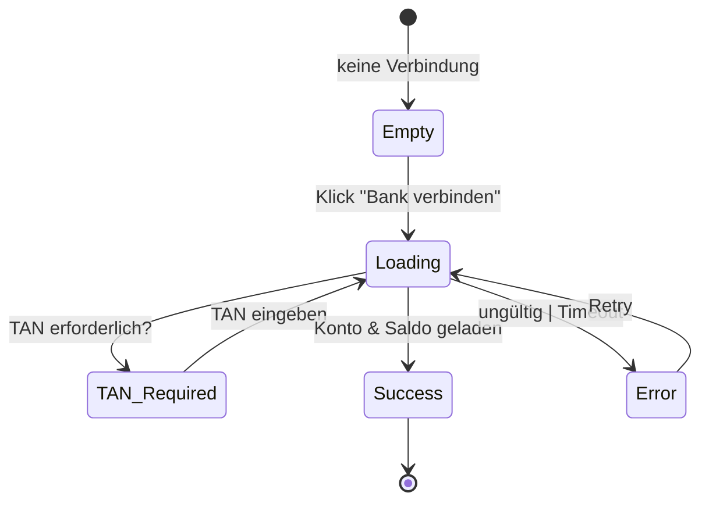

### 2) PayPal Sync

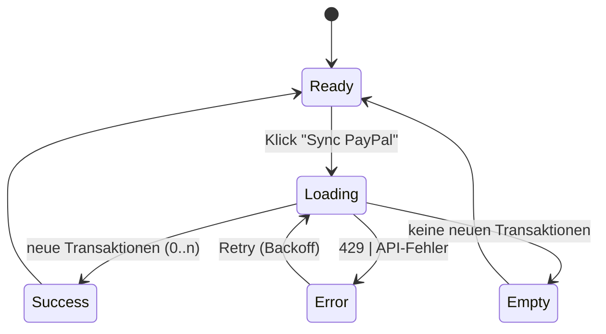

### 3) Broker-Import (CSV/PDF)

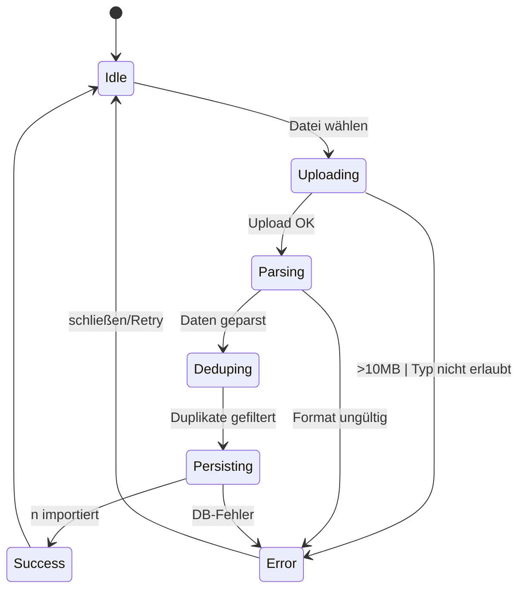

### 4) Suche & Filter

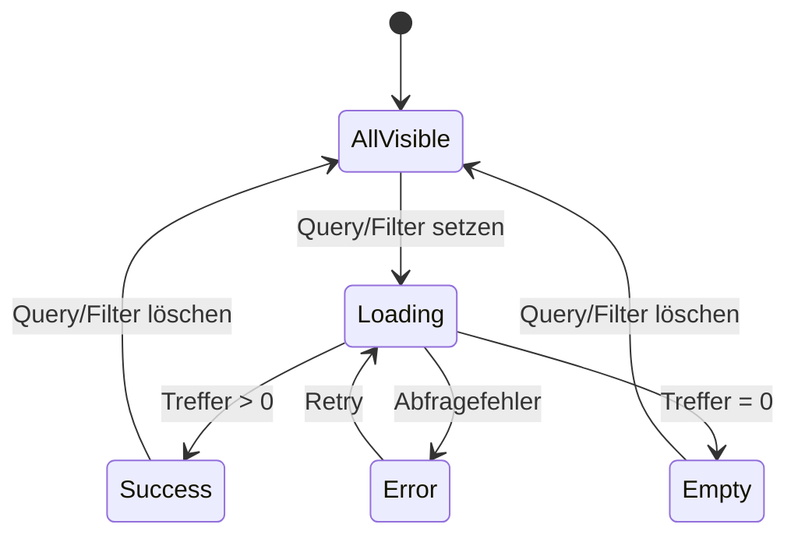

### 5) Transaktions-Detailansicht

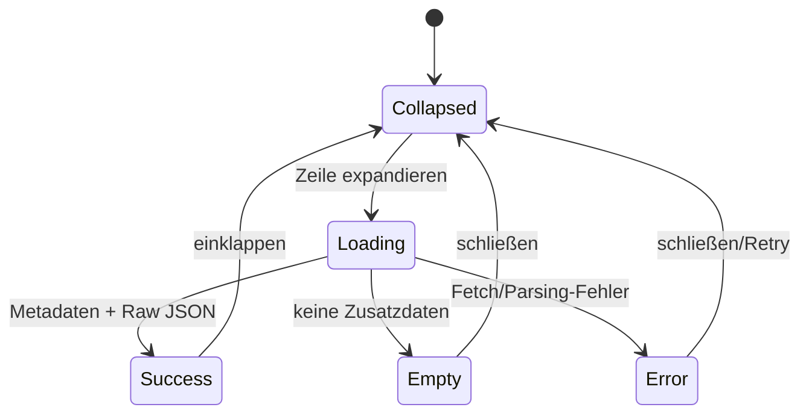

### 6) Manuelles Tagging (einzelne Transaktion)

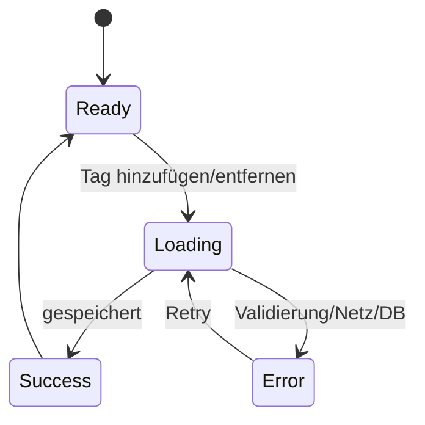

### 7) Mehrfachauswahl (Bulk Actions, Phase 2)

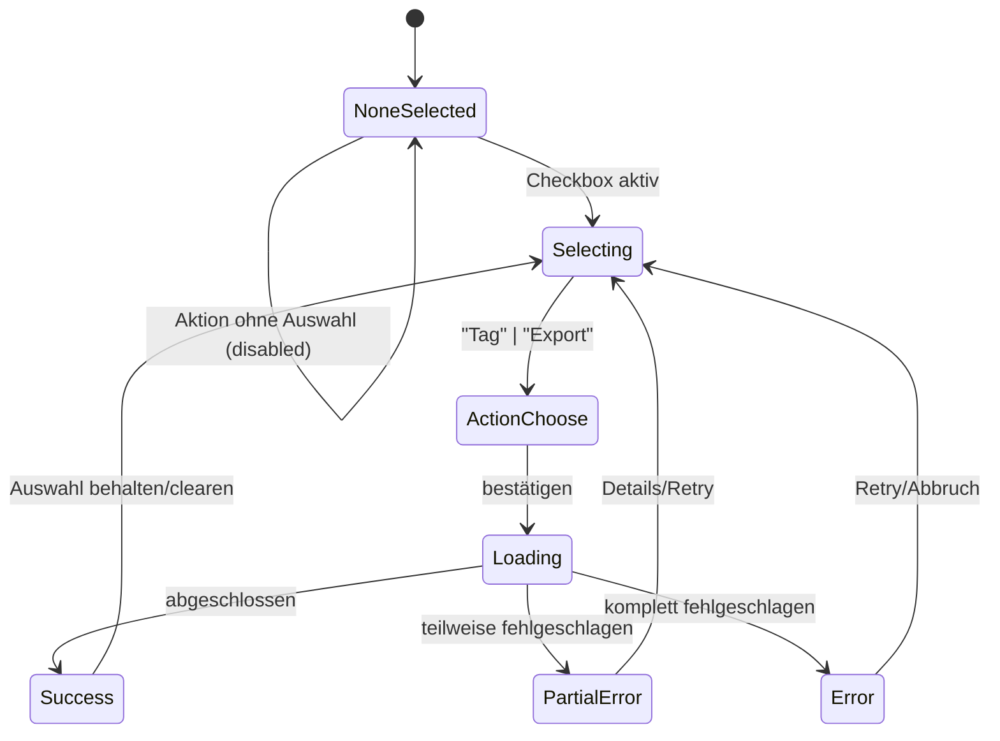

### 8) Budgets

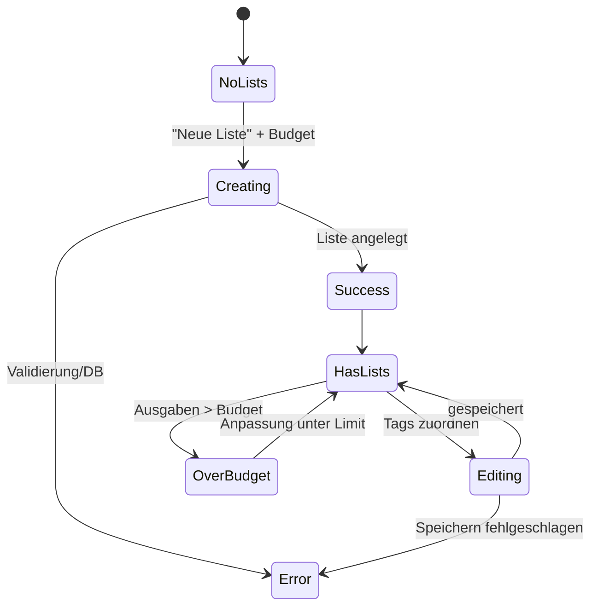

### 9) Befehlspalette (⌘K/Ctrl+K)

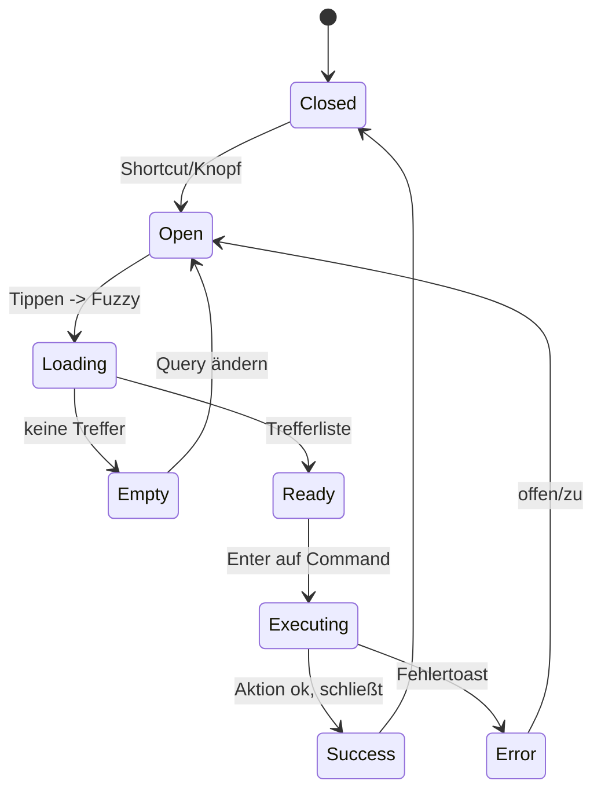

### 10) Offline-Modus (Cache & Sync)

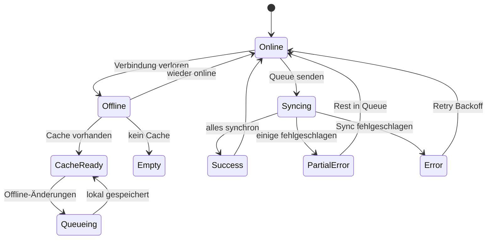

### 11) Benachrichtigungen / Toasts

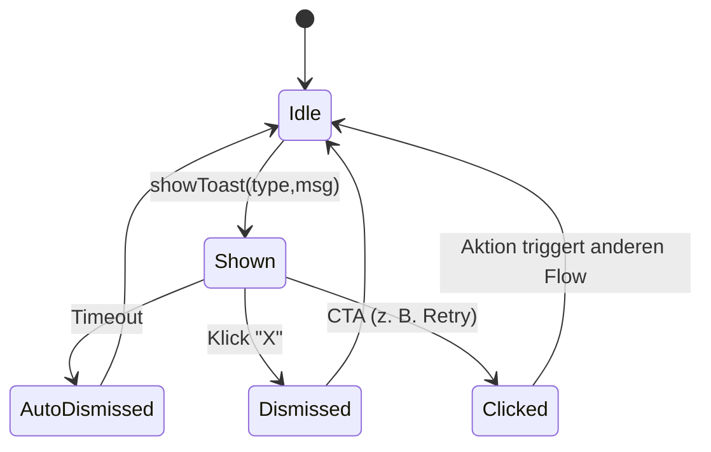
